# TermIDE

[](https://github.com/termide/termide/releases)
[](https://github.com/termide/termide/actions)
[](https://opensource.org/licenses/MIT)

[English](README.md) | [中文](README.zh.md) | **Русский**

Терминальное рабочее место «всё в одном» для рабочей машины и серверов: редактор кода с LSP, двухпанельный файловый менеджер с SFTP/FTP, терминал, git, просмотр баз данных и агент для кода — в одном статическом бинарнике на Rust без настройки.

**[Сайт](https://termide.github.io)** | **[Документация](doc/ru/README.md)** | **[Релизы](https://github.com/termide/termide/releases)** | **[Скриншоты](https://termide.github.io/ru/#screenshots)**

<p align="center">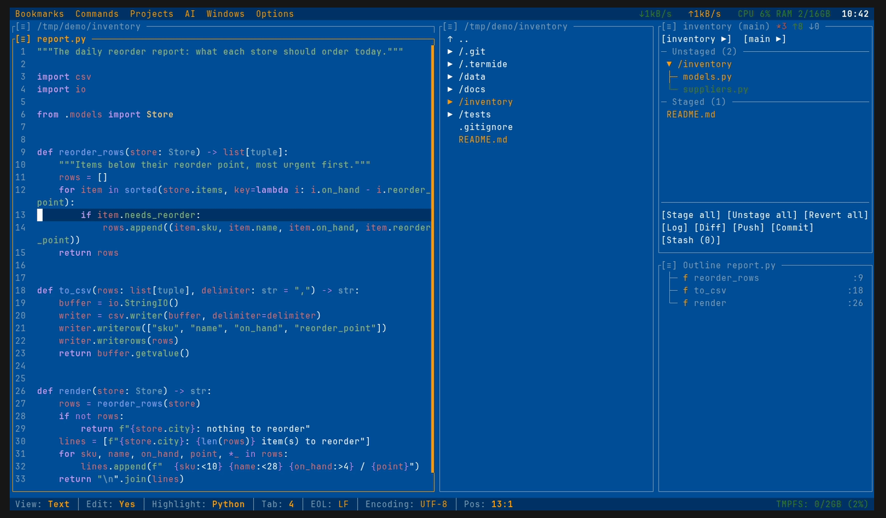</p>

## Почему TermIDE?

Терминальные редакторы закрывают работу с кодом, а всё вокруг — файлы на удалённых хостах, базы данных, git, долгоживущие шеллы, агент для кода — обычно требует плагинов или отдельных утилит. TermIDE поставляет всё это в одном бинарнике, который работает из коробки на ноутбуке, сервере или телефоне. Он не пытается заменить эти утилиты — он закрывает ту часть, к которой вы обращаетесь каждый день, в одном месте:

| Задача | Обычно | В TermIDE |
|--------|--------|-----------|
| Сохранить работу после обрыва SSH | tmux, screen | Отсоединяемые экземпляры |
| Переносить файлы между хостами | mc, ranger, scp | Двухпанельный файловый менеджер с SFTP / FTP |
| Править код и конфиги | vim, nano | Редактор с LSP |
| Просмотреть изменения и закоммитить | lazygit, tig | Панели статуса, журнала и диффа git |
| Найти, что нагружает машину | htop, ss | Монитор ресурсов |
| Заглянуть в базу данных | sqlite3, psql | Просмотр баз данных |
| Попросить модель изменить код | aider, Claude Code | Панель агента или эти агенты внутри неё |

Редактор, LSP, терминал, git и раскладки проектов среди терминальных редакторов само собой разумеются; в таблице — то, чего у других нет или что они оставляют плагинам:

| Возможность | TermIDE | Fresh | Vim/Neovim | Helix | Micro |
|---------|:-------:|:-----:|:----------:|:-----:|:-----:|
| Встроенный агент для кода (локальные или облачные модели) | ✓ | ✗ | плагин | ✗ | ✗ |
| MCP-серверы | ✓ | ✗ | плагин | ✗ | ✗ |
| Двухпанельный файловый менеджер | ✓ | только дерево | плагин | ✗ | ✗ |
| Фоновые файловые операции | ✓ | ✗ | плагин | ✗ | ✗ |
| Хранилище паролей | ✓ | ✗ | плагин | ✗ | ✗ |
| Просмотр баз данных | ✓ | ✗ | плагин | ✗ | ✗ |
| Просмотр и редактор hex / бинарных файлов | ✓ | ✗ | плагин | ✗ | плагин |
| Просмотр диаграмм (Mermaid) | ✓ | ✗ | плагин | ✗ | ✗ |
| Предпросмотр HTML | ✓ | ✗ | плагин | ✗ | ✗ |
| Просмотр изображений | ✓ | ✗ | плагин | ✗ | ✗ |
| Монитор ресурсов | ✓ | ✗ | ✗ | ✗ | ✗ |

**TermIDE = Редактор + Файловый менеджер + Терминал + Git + Агент в одном TUI-приложении.**

## Принципы

- **Самодостаточность** - Один статический бинарник без зависимостей времени выполнения: SSH, TLS и криптография на чистом Rust, поэтому один и тот же файл работает в Alpine, в distroless-контейнере и в Termux. Инструменты, которые у вас уже есть, — git, языковые серверы, браузер для веб-поиска агента — подхватываются, если установлены.
- **Дома и на десктопе, и на сервере** - Нативная графика и системный буфер обмена на рабочей машине; по SSH `termide --detached` сохраняет редакторы, оболочки и задачи живыми после обрыва связи ([Отсоединяемые экземпляры](doc/ru/detached-instances.md)), а файловый менеджер достаёт до других хостов по SFTP / FTP.
- **Ваши данные остаются вашими** - Никакой телеметрии и проверок обновлений: termide подключается только к тем серверам, базам данных и endpoint'ам моделей, которые вы указали. Агент выключен, пока вы не настроите модель, а с локальной моделью ваш код не покидает машину.
- **Секреты под защитой** - Пароли подключений хранятся в зашифрованном хранилище под мастер-паролем (Argon2 + ChaCha20-Poly1305) и никогда не попадают в закладки, раскладки и логи ([Хранилище паролей](doc/ru/passwords.md)); ключи API читаются из переменных окружения.
- **Ничего не скрыто** - Всё, что видит модель агента, — системный промпт, служебные промпты, описания инструментов — лежит обычными файлами, которые можно прочитать и переопределить, а `/prompt` показывает собранный результат ([Системный промпт](doc/ru/agent.md#системный-промпт)). Настройки, горячие клавиши, темы и команды — в TOML.

## Возможности

| | |
|:---:|:---:|
| 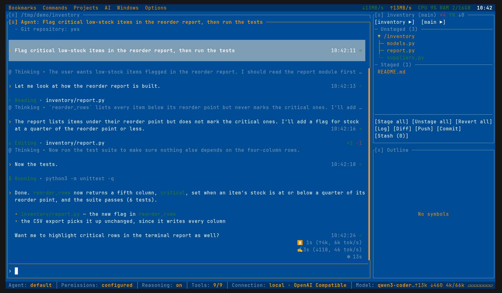 | 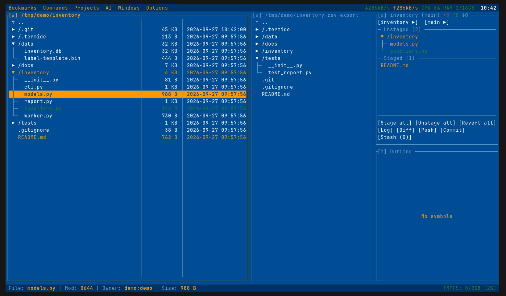 |
| Агент для кода за работой | Файловый менеджер с вложенным git-статусом |
| 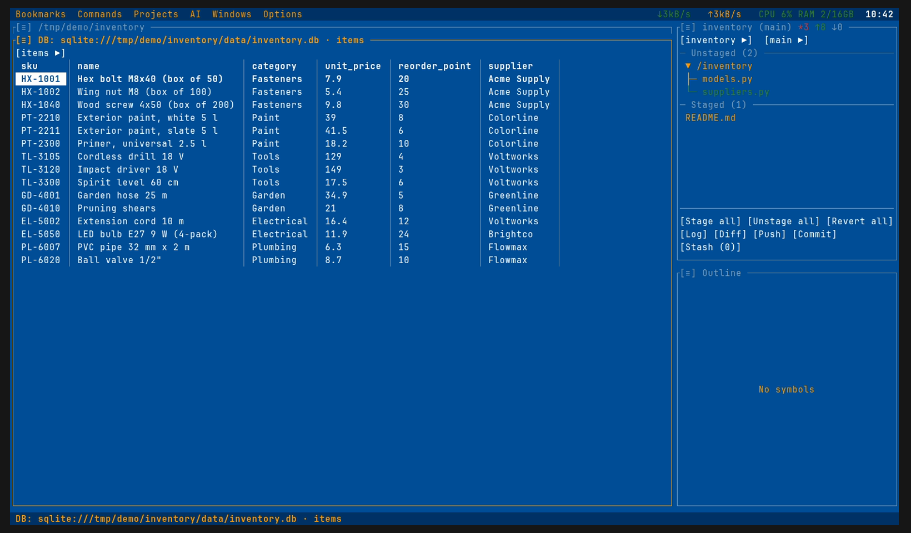 | 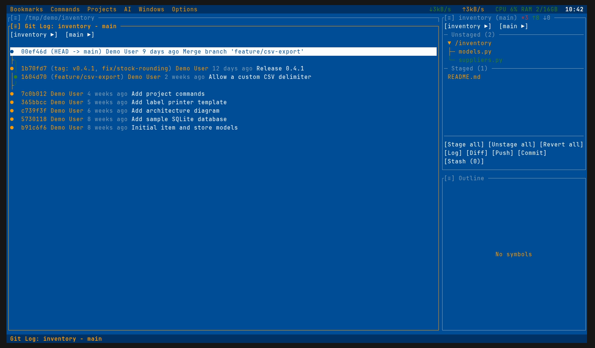 |
| Просмотр баз данных | Журнал git с графом коммитов |

### Код

- **Редактор** - Подсветка синтаксиса для 23 языков, LSP: автодополнение, подсказки при наведении, переход к определению, поиск ссылок, переименование и диагностика; переключение комментариев, автоотступы, автозакрытие скобок; опциональный Vim-режим
- **Структура и диагностика** - Навигация по структуре кода, синхронизированная с курсором (`Alt+O`), и панель диагностики LSP (`Alt+I`)
- **Поиск и замена** - Живой предпросмотр, счётчик совпадений, regex
- **Документация рядом с кодом** - Рендер Markdown, HTML (текстовый браузер, сохраняющий страницы как Markdown) и диаграмм Mermaid текстовой псевдографикой; `Ctrl+E` переключает на исходник
- **Hex-редактор** - Hex/ASCII-вид с курсором байта, выделением и поиском; редактирование с перезаписью и резервной копией `.bak`
- **Изображения** - Нативная графика в Kitty, WezTerm, iTerm2, Ghostty и foot

### Агент для кода

- **Своя модель** - Любой OpenAI- или Anthropic-совместимый endpoint: llama.cpp, Ollama, vLLM, omlx на вашей машине или облачный провайдер
- **Ничего не меняется без вас** - Разрешение на каждый вызов инструмента или модель-ревьюер в режиме auto; `/undo` и контрольные точки откатывают правки
- **Режим планирования и субагенты** - Агент вместе с вами решает открытые вопросы, прежде чем написать план; субагенты работают параллельно
- **Инструменты** - Чтение, правка, оболочка, веб-поиск и загрузка страниц, `recall` по прошлым сессиям, истории git и файлам проекта, MCP-серверы
- **Другие агенты в той же панели** - Claude Code, Codex и Gemini CLI по Agent Client Protocol
- **Расширение файлами** - Скиллы, шаблоны промптов, скрипты команд, хуки и инструкции проекта
- **Без интерфейса** - `termide --prompt "..." --output json` запускает того же агента в скриптах и CI

### Файлы и данные

- **Двухпанельный файловый менеджер** - Дерево с вложенным git-статусом, поиск по glob и regex, пакетные операции; архивы zip, tar и ISO открываются как каталоги, а `P` упаковывает выделенное; файлы копируются и вставляются в другие приложения и из них через системный буфер обмена
- **Удалённые файловые системы** - SFTP, FTP и FTPS на чистом Rust, с копированием между локальной и удалённой панелями; `smb://` и `nfs://` через системное монтирование
- **Фоновые операции** - Копирование, перемещение, загрузка и скачивание с прогрессом, паузой, возобновлением и отменой
- **Просмотр баз данных** - SQLite, PostgreSQL и MySQL по URL-закладке: серверная сортировка, фильтры по столбцам, редактирование ячеек, строки в TSV, JSON или INSERT
- **Хранилище паролей** - Пароли удалённых хостов, баз данных и git в зашифрованном хранилище под мастер-паролем
- **Закладки и переключатель каталогов** - Сохранённые места и быстрая смена каталога по `Ctrl+\`

### Серверы и эксплуатация

- **Отсоединяемые экземпляры** - `termide --detached` оставляет редакторы, оболочки и задачи работать после закрытия терминала; `--attach` возвращает их в терминале любого размера (Unix)
- **Встроенный терминал** - Полная поддержка PTY, escape-последовательности VT100, отслеживание мыши
- **Монитор ресурсов** - CPU, RAM, сеть и диск в меню-баре и статус-баре; по клику — самые активные процессы и слушающие порты
- **Ваш `$EDITOR`** - `EDITOR=termide` для `git commit`, `crontab -e` и `visudo`
- **Один статический бинарник** - Linux x86_64 и ARM64 (glibc или musl), macOS, нативный Windows и Android Termux

### Рабочее пространство

- **Git** - Статус, журнал с цветным графом коммитов, дифф, индексация, stash, blame, ветки с их рабочими копиями
- **Проекты** - Раскладки панелей восстанавливаются для каждого проекта; проекты, с которых вы переключились, продолжают работать в фоне и видны кнопками в меню-баре; `termide --restore` открывает проекты прошлого запуска
- **Многопанельный интерфейс** - Группы панелей с настраиваемой высотой, полноэкранный режим (`Alt+F11`) и автоматическая перекомпоновка в узком терминале
- **Пользовательские команды** - Глобальные и проектные команды с горячими клавишами, формами параметров и режимами терминал / фон / отчёт
- **Палитра команд и строка «Открыть»** - `Ctrl+P` запускает любую команду по нечёткому имени; `Ctrl+G` открывает файл, каталог или URL с подсказками путей
- **Настройки** - Полноэкранное окно настроек (`Alt+P`) с захватом горячих клавиш на месте

### Внешний вид и управление

- **44 встроенные темы** - Тёмные, светлые, ретро и кинематографичные; свои темы — в TOML
- **15 языков интерфейса** - Бенгальский, китайский, английский, французский, немецкий, хинди, индонезийский, японский, корейский, португальский, русский, испанский, тайский, турецкий, вьетнамский
- **Клавиатура и мышь** - Полная поддержка мыши; горячие клавиши работают в кириллической раскладке; `Shift+Enter` открывает файл в системном приложении

## Вопросы и ответы

**Обязательно ли пользоваться ИИ-агентом?** Нет. По умолчанию провайдер и модель не заданы, поэтому агент ничего не делает и ничего не отправляет, пока вы его не настроите. Всё остальное работает без него.

**TermIDE отправляет что-нибудь разработчикам?** Нет телеметрии, аккаунта и проверок обновлений. В сеть он выходит, только когда вы просите: удалённое расположение, веб-страница, `git push` или `pull`, модель для агента.

**Заменяет ли он tmux?** Для сохранения работы по SSH — да: `termide --detached` держит всё рабочее пространство запущенным, а `--attach` возвращает его. Произвольными сессиями и окнами, как tmux, он не управляет и спокойно работает внутри tmux.

**Какой нужен терминал?** Любой современный терминал с true color. Изображения рисуются нативно в Kitty, WezTerm, iTerm2, Ghostty и foot; горячие клавиши с `Alt` на macOS работают в терминалах с протоколом клавиатуры Kitty.

**Работает ли он в Windows?** Да, нативно через ConPTY в Windows Terminal или в WSL. Отсоединяемые экземпляры — только в Unix.

## Установка

Linux и macOS — скрипт определяет систему и предлагает подходящие способы (пакет, Homebrew, бинарник, Nix или Cargo):

```bash
curl -fsSL https://raw.githubusercontent.com/termide/termide/main/install.sh | sh
```

Или через пакетный менеджер:

```bash
brew tap termide/termide && brew install termide   # macOS / Linux
yay -S termide-bin                                 # Arch Linux (AUR)
nix run github:termide/termide                     # Nix, без установки
```

На сервере достаточно скопировать [статический musl-бинарник](#portable-static-binary) и запустить — больше ничего ставить не нужно.

**Поддерживаемые платформы:** Linux (x86_64, ARM64), macOS (Intel, Apple Silicon), Windows (x86_64)

### Выберите способ установки

<details>
<summary><b>📦 Готовые бинарники</b></summary>

Скачайте последний релиз для вашей платформы с [GitHub Releases](https://github.com/termide/termide/releases):

```bash
# Linux x86_64 (также работает в WSL)
wget https://github.com/termide/termide/releases/latest/download/termide-0.40.0-x86_64-unknown-linux-gnu.tar.gz
tar xzf termide-0.40.0-x86_64-unknown-linux-gnu.tar.gz
./termide

# Linux x86_64 (статический musl — Alpine, distroless-контейнеры, любая система без glibc)
wget https://github.com/termide/termide/releases/latest/download/termide-0.40.0-x86_64-unknown-linux-musl.tar.gz
tar xzf termide-0.40.0-x86_64-unknown-linux-musl.tar.gz
./termide

# macOS Intel (x86_64)
curl -LO https://github.com/termide/termide/releases/latest/download/termide-0.40.0-x86_64-apple-darwin.tar.gz
tar xzf termide-0.40.0-x86_64-apple-darwin.tar.gz
./termide

# macOS Apple Silicon (ARM64)
curl -LO https://github.com/termide/termide/releases/latest/download/termide-0.40.0-aarch64-apple-darwin.tar.gz
tar xzf termide-0.40.0-aarch64-apple-darwin.tar.gz
./termide

# Linux ARM64 (Raspberry Pi, ARM-серверы)
wget https://github.com/termide/termide/releases/latest/download/termide-0.40.0-aarch64-unknown-linux-gnu.tar.gz
tar xzf termide-0.40.0-aarch64-unknown-linux-gnu.tar.gz
./termide

# Linux ARM64 (статический musl — Android/Termux, Alpine ARM, любой ARM64 без glibc)
wget https://github.com/termide/termide/releases/latest/download/termide-0.40.0-aarch64-unknown-linux-musl.tar.gz
tar xzf termide-0.40.0-aarch64-unknown-linux-musl.tar.gz
./termide

# Windows x86_64 (скачайте .zip с Releases, распакуйте, запустите в Windows Terminal)
# https://github.com/termide/termide/releases/latest/download/termide-0.40.0-x86_64-pc-windows-msvc.zip
```

</details>

<details>
<summary><b>🪟 Windows (.zip)</b></summary>

TermIDE работает нативно на Windows 10+ через ConPTY. Для лучшего опыта используйте **Windows Terminal**.

1. Скачайте `termide-0.40.0-x86_64-pc-windows-msvc.zip` с [GitHub Releases](https://github.com/termide/termide/releases).
2. Распакуйте архив.
3. Запустите `termide.exe` в Windows Terminal.

Конфигурация, раскладки проектов и логи хранятся в `%APPDATA%\termide\`.

Либо в **WSL/WSL2** используйте сборку Linux x86_64 (`termide-0.40.0-x86_64-unknown-linux-gnu.tar.gz`), как на любом Linux.

</details>

<details>
<summary><b>🐧 Debian/Ubuntu (.deb)</b></summary>

Скачайте и установите пакет `.deb` с [GitHub Releases](https://github.com/termide/termide/releases):

```bash
# Только x86_64 (для ARM64 используйте tar.gz выше)
wget https://github.com/termide/termide/releases/latest/download/termide_0.40.0-1_amd64.deb
sudo dpkg -i termide_0.40.0-1_amd64.deb
```

</details>

<details>
<summary><b>🎩 Fedora/RHEL/CentOS (.rpm)</b></summary>

Скачайте и установите пакет `.rpm` с [GitHub Releases](https://github.com/termide/termide/releases):

```bash
# Только x86_64 (для ARM64 используйте tar.gz выше)
wget https://github.com/termide/termide/releases/latest/download/termide-0.40.0-1.x86_64.rpm
sudo rpm -i termide-0.40.0-1.x86_64.rpm
```

</details>

<details>
<summary><b>🐧 Arch Linux (AUR)</b></summary>

Установите из AUR любимым AUR-помощником:

```bash
# Сборка из исходников
yay -S termide

# Или готовый бинарник
yay -S termide-bin
```

Либо вручную:

```bash
git clone https://aur.archlinux.org/termide.git
cd termide
makepkg -si
```

</details>

<details>
<summary><b>🍺 Homebrew (macOS/Linux)</b></summary>

Установите через Homebrew tap:

```bash
brew tap termide/termide
brew install termide
```

</details>

<details>
<summary><b>❄️ NixOS/Nix (Flakes)</b></summary>

Установите через Nix flakes:

```bash
# Запуск без установки
nix run github:termide/termide

# Установка в профиль пользователя
nix profile install github:termide/termide

# Или добавьте в NixOS configuration.nix
{
  nixpkgs.overlays = [
    (import (builtins.fetchTarball "https://github.com/termide/termide/archive/main.tar.gz")).overlays.default
  ];
  environment.systemPackages = [ pkgs.termide ];
}
```

</details>

<details>
<summary><b>🤖 Android (Termux)</b></summary>

В [Termux](https://termux.dev) используйте сборку **статического ARM64 musl** (сборка glibc
`aarch64-unknown-linux-gnu` не работает на Bionic libc Android):

```bash
pkg install git openssh   # инструменты, которые вызывает termide (а также нужные LSP-серверы)
wget https://github.com/termide/termide/releases/latest/download/termide-0.40.0-aarch64-unknown-linux-musl.tar.gz
tar xzf termide-0.40.0-aarch64-unknown-linux-musl.tar.gz
./termide
```

Примечания: на Android нет системного буфера обмена (нет X11/Wayland), а монитор ресурсов
может показывать неполные данные из-за ограниченного `/proc`. Редактор, файловый менеджер,
git и встроенный терминал работают штатно.

</details>

<details>
<summary><b>🔨 Сборка из исходников (Cargo)</b></summary>

Сборка из исходников с помощью Cargo:

```bash
# Клонировать репозиторий
git clone https://github.com/termide/termide.git
cd termide

# Собрать и запустить
cargo run --release
```

</details>

<details>
<summary><b>🔨 Сборка из исходников (Nix)</b></summary>

Сборка из исходников с помощью Nix (для разработки):

```bash
# Клонировать репозиторий
git clone https://github.com/termide/termide.git
cd termide

# Войти в окружение разработки (включает Rust-тулчейн и все зависимости)
nix develop

# Собрать проект
cargo build --release

# Запустить
./target/release/termide
```

</details>

<a id="portable-static-binary"></a>
<details>
<summary><b>📦 Переносимый статический бинарник (Alpine / любой Linux)</b></summary>

С каждым релизом публикуется полностью статическая сборка musl. Она не линкует
разделяемых библиотек и работает на любом дистрибутиве Linux, включая Alpine и
минимальные контейнеры. Весь проект на чистом Rust (rustls + russh + russh-sftp —
без OpenSSL и libssh2), поэтому это тот же код, просто собранный под musl.

Проще всего взять готовый tarball из релиза:

```bash
wget https://github.com/termide/termide/releases/latest/download/termide-0.40.0-x86_64-unknown-linux-musl.tar.gz
tar xzf termide-0.40.0-x86_64-unknown-linux-musl.tar.gz
./termide

# Проверка полной статичности — нет разделяемых библиотек
ldd ./termide   # → "not a dynamic executable"
```

Если хотите собрать сами (например, под другой вариант musl), flake предоставляет
тот же рецепт как деривацию:

```bash
nix build github:termide/termide#termide-static
./result/bin/termide
```

Любой из бинарников можно скопировать куда угодно — в контейнер, урезанный образ
Alpine, embedded-устройство — и он будет работать без установленных musl-dev или glibc.

</details>

## Опции командной строки

```
termide [OPTIONS] [FILE]...

Аргументы:
  [FILE]...            Файл(ы) или каталоги для открытия. С путём TermIDE
                       стартует в чистом виде (раскладка проекта не
                       восстанавливается и не сохраняется). Текст открывается
                       в редакторе, поэтому TermIDE работает как $EDITOR для
                       git, crontab, visudo и т. д.; изображения, файлы SQLite,
                       прочие бинарные файлы и каталоги — в своём просмотрщике,
                       hex-редакторе или файловом менеджере.

Опции:
  --log-level <LEVEL>  Уровень логирования (trace, debug, info, warn, error)
  --no-lsp             Отключить LSP-серверы
  -r, --restore        Открыть проекты прошлого запуска в том проекте, где он был
  --config <PATH>      Использовать свой путь к файлу конфигурации
  --diagnostics        Прогнать предполётную диагностику и выйти (без UI)
  --detached           Запустить отсоединённый экземпляр, переживающий закрытие
                       терминала, и напечатать его идентификатор (только Unix)
  --attach [<ID>]      Подключиться к отсоединённому экземпляру, по умолчанию
                       к последнему
  -f, --force          С --attach: перехватить экземпляр у уже подключённого
                       клиента, отключив его
  --kill <ID>          Завершить отсоединённый экземпляр со всеми оболочками и
                       задачами в нём и выйти; несохранённые изменения теряются
  --list-instances     Показать отсоединённые экземпляры и выйти
  --completions <SHELL>
                       Напечатать скрипт автодополнения (bash, zsh, fish) и выйти
  --install-completions [<SHELL>]
                       Установить автодополнение для $SHELL или названной оболочки
  --prompt <PROMPT>    Выполнить одну задачу агента без UI, напечатать ответ
                       в stdout и выйти; `-` читает запрос из stdin
  --agent <NAME>       С --prompt: какое определение агента использовать
  --output <FORMAT>    С --prompt: text (по умолчанию), json или stream-json
  -h, --help           Показать справку
  -V, --version        Показать версию
```

Использование в качестве редактора:

```sh
export EDITOR=termide   # git commit, crontab -e, visudo, ...
```

## Использование

### Быстрый старт

После запуска TermIDE вы увидите раскладку, адаптивную по ширине:
- **Широкие терминалы (>= 160 колонок):** Боковая панель (Git Status в стопке с Operations) + две панели файлового менеджера
- **Обычные терминалы (< 160 колонок):** Боковая панель (Git Status, файловый менеджер и Operations в стопке) + панель файлового менеджера
- Меню-бар сверху, статус-бар снизу

Панели в стопке делят колонку с настраиваемой высотой каждой. `Alt+F11` переключает пресет «полноэкранная текущая панель» (одна панель занимает всю высоту колонки, остальные сворачиваются в строку заголовка); `Ctrl+Alt+=` / `Ctrl+Alt+-` увеличивают / уменьшают фокусную панель на 3 строки.

Используйте `Alt+←/→` для переключения групп панелей, `Alt+↑/↓` для навигации внутри группы, `Alt+M` для открытия меню.

### Документация

Подробная документация:
- **Английский**: [doc/en/README.md](doc/en/README.md)
- **Русский**: [doc/ru/README.md](doc/ru/README.md)
- **Китайский**: [doc/zh/README.md](doc/zh/README.md)

### Горячие клавиши

Все клавиши настраиваются в `config.toml` (см. [Конфигурация](#конфигурация)). Основное:

- **Навигация:** `Alt+M` меню · `Alt+H` помощь · `Alt+Q` выход · `Ctrl+P` палитра команд
- **Панели:** `Alt+←/→` и `Alt+↑/↓` перемещение между/внутри групп · `Alt+K` меню действий панели
- **Проекты:** `Alt+1-9` переход к открытому проекту · `Alt+\` переключатель проектов · `Alt+N` новый проект
- **Открыть:** `Alt+F` Файлы · `Alt+T` Терминал · `Alt+E` Редактор · `Alt+G` Git · `Alt+P` Настройки
- **Файлы и просмотрщики:** `F3` предпросмотр (markdown / диаграмма / hex / изображение) · `Ctrl+E` переключение предпросмотр ↔ исходник · `Ctrl+F` поиск · `Ctrl+R` перечитать с диска · `Ctrl+S` сохранить

📖 Полный справочник по панелям (файловый менеджер, редактор, git, просмотрщики): **[doc/ru/keybindings.md](doc/ru/keybindings.md)**.

## Конфигурация

TermIDE следует [спецификации XDG Base Directory](https://specifications.freedesktop.org/basedir-spec/basedir-spec-latest.html) для организации файлов.

**Расположение файла конфигурации:**
- Linux/BSD: `~/.config/termide/config.toml` (или `$XDG_CONFIG_HOME/termide/config.toml`)
- macOS: `~/Library/Application Support/termide/config.toml`
- Windows: `%APPDATA%\termide\config.toml`

Проект может переопределить любую настройку в `<проект>/.termide/config.toml`.
Настройка с неверным типом или значением игнорируется по отдельности, и об этом
пишется в Журнал; остальной файл продолжает действовать. Следующее сохранение из
настроек перезапишет файл уже без проигнорированной настройки, поэтому перед этим
исходный файл копируется рядом в `config.toml.bak`. `termide --diagnostics` показывает
те же проблемы.

**Расположение данных проектов:**
- Linux/BSD: `~/.local/share/termide/projects/` (или `$XDG_DATA_HOME/termide/projects/`)
- macOS: `~/Library/Application Support/termide/projects/`
- Windows: `%APPDATA%\termide\projects\`

**Расположение файла логов:** каждый запуск пишет свой `session-<date>-<time>.log`
в каталог проекта внутри расположения данных проектов, указанного выше; логи
старше 24 часов удаляются. `logging.file_path` заменяет это одним фиксированным
файлом.

**Расположение закладок:**
- Linux/BSD: `~/.config/termide/bookmarks.toml` (или `$XDG_CONFIG_HOME/termide/bookmarks.toml`)
- macOS: `~/Library/Application Support/termide/bookmarks.toml`
- Windows: `%APPDATA%\termide\bookmarks.toml`

### Пример конфигурации

```toml
[general]
theme = "windows-xp"
language = "auto"  # auto, bn, de, en, es, fr, hi, id, ja, ko, pt, ru, th, tr, vi, zh
vim_mode = false
project_retention_days = 30
bell_on_operation_complete = true
icon_mode = "auto"  # auto, emoji, unicode
always_detachable = false  # экземпляр переживает закрытие терминала (Unix)
resource_monitor_interval = 1000

[editor]
tab_size = 4
show_git_diff = true
word_wrap = true
auto_indent = true
auto_close_brackets = true

[file_manager]
extended_view_width = 50

[lsp]
enabled = true
auto_completion = true

[logging]
min_level = "info"
```

### Темы

44 встроенные темы — тёмные, светлые, ретро (Norton Commander, FAR Manager, Windows 95) и кинематографичные (Matrix, Pip-Boy) — переключаются из меню или параметром `theme` в `config.toml`. Полный список — в разделе [Темы](doc/ru/themes.md).

| | | |
|:---:|:---:|:---:|
| 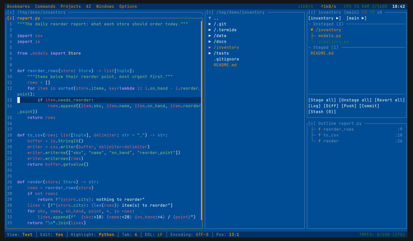 | 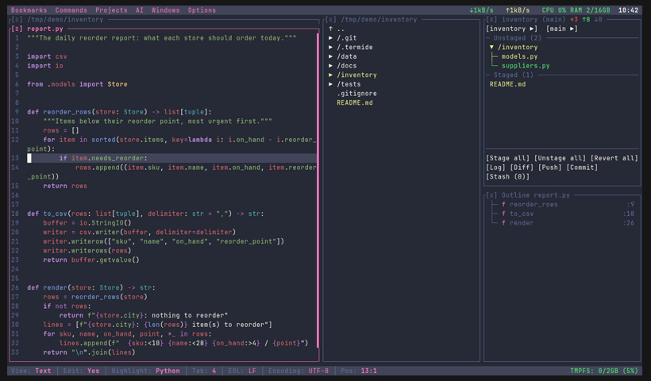 | 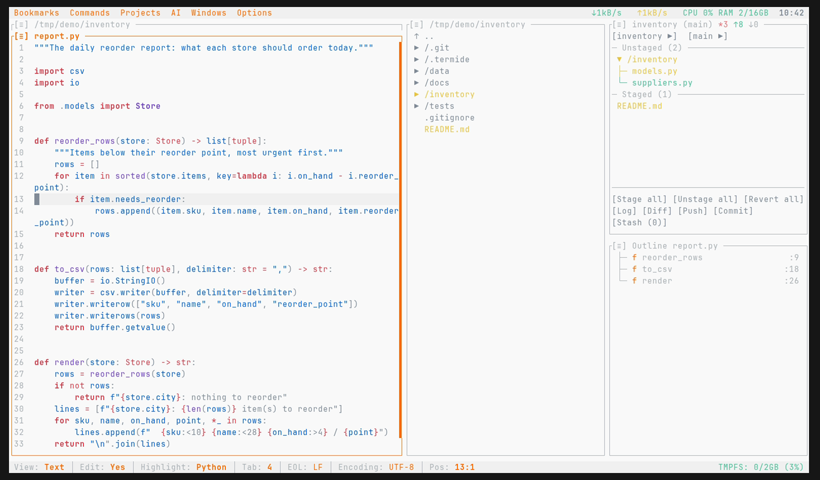 |
| Windows XP (по умолчанию) | Dracula | Ayu Light |
| 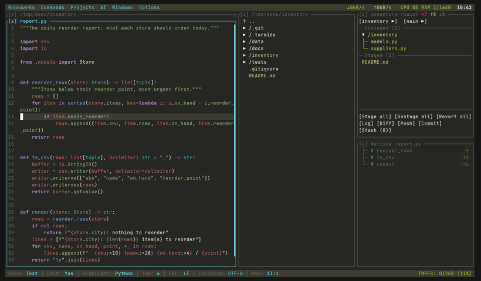 | 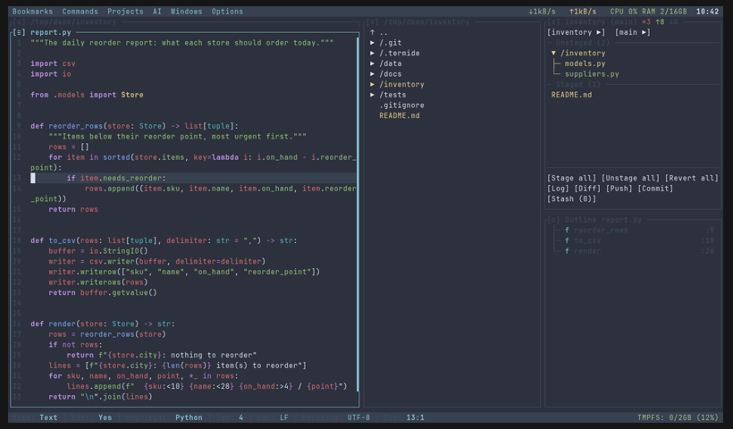 | 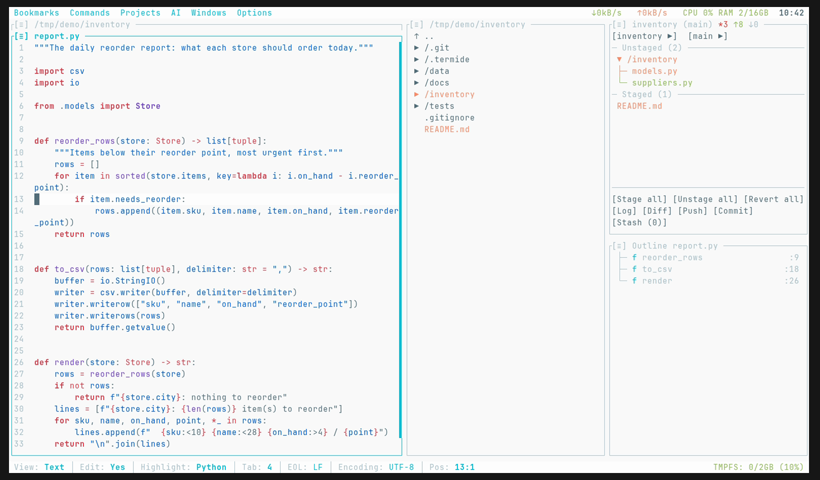 |
| Monokai | Nord | Material Lighter |

### Пользовательские темы

Свои темы создаются размещением TOML-файлов в каталоге тем:
- Linux: `~/.config/termide/themes/`
- macOS: `~/Library/Application Support/termide/themes/`
- Windows: `%APPDATA%\termide\themes\`

Пользовательские темы имеют приоритет над встроенными с тем же именем. Примеры формата файла темы — в каталоге `crates/theme/themes/` репозитория.

### Пользовательские команды

Часто запускаемые команды оболочки описываются в `commands.toml` — глобальном,
в каталоге конфигурации, или `<проект>/.termide/commands.toml` для проекта — и
появляются в меню **Команды**:

```toml
[test]
name = "Run tests"
command = "cargo nextest run"
group = "cargo"
key = "Ctrl+Shift+T"

[clippy]
command = "cargo clippy --workspace -- -D warnings"
mode = "report"  # terminal (по умолчанию), background или report
```

`Команды → Добавить команду...` создаёт команду через форму. Режимы, параметры
и горячие клавиши описаны в [Пользовательских командах](doc/ru/actions.md).

## Разработка

Код — Cargo workspace из модульных крейтов; версию тулчейна задаёт `rust-toolchain.toml`. Сборка, тесты, Nix-окружение и pre-commit hook описаны в **[Руководстве разработчика](doc/ru/developer-guide.md)**, раскладка крейтов, система панелей и поток событий — в **[Архитектуре](doc/ru/architecture.md)**.

## Вклад

Issues и pull requests приветствуются. Один раз на клон выполните `git config core.hooksPath .githooks`: pre-commit hook запускает те же проверки `fmt`, `clippy` и тестов, что и CI.

## Лицензия

Проект распространяется под лицензией MIT.

## Благодарности

Построено на:
- [ratatui](https://github.com/ratatui-org/ratatui) - Фреймворк терминального UI
- [crossterm](https://github.com/crossterm-rs/crossterm) - Кроссплатформенная работа с терминалом
- [portable-pty](https://github.com/wez/wezterm/tree/main/pty) - Реализация PTY
- [tree-sitter](https://github.com/tree-sitter/tree-sitter) - Подсветка синтаксиса
- [ropey](https://github.com/cessen/ropey) - Текстовый буфер
- [sysinfo](https://github.com/GuillaumeGomez/sysinfo) - Мониторинг системных ресурсов
- [russh](https://github.com/Eugeny/russh) и [russh-sftp](https://github.com/AspectUnk/russh-sftp) - SSH и SFTP на чистом Rust
- [suppaftp](https://github.com/veeso/suppaftp) - FTP / FTPS
- [rustls](https://github.com/rustls/rustls) - TLS без OpenSSL
- [SQLx](https://github.com/launchbadge/sqlx) - Доступ к SQLite, PostgreSQL и MySQL
- [RustCrypto](https://github.com/RustCrypto) - Argon2 и ChaCha20-Poly1305 для хранилища паролей
- [nucleo](https://github.com/helix-editor/nucleo) - Нечёткий поиск
- [pulldown-cmark](https://github.com/pulldown-cmark/pulldown-cmark) и [html5ever](https://github.com/servo/html5ever) - Разбор Markdown и HTML
